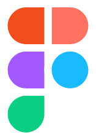

  

  👋 Hi! I'm Junus — co-founder of the Developer Akademie and passionate content creator. I've been into programming since a young age and love helping others understand the world of IT.
    
  My focus: creating content that makes learning approachable and practical — so tech feels less intimidating and more empowering.

###
##  Developer Akademie

<table >
  <tr>
    <td></td>
    <td style="padding-left: 12px;">
      Gründer & CTO 
      Developer Akademie
    </td>
  </tr>
</table>

##  GitHub Stats

  
  

###

## Preferred Tech Stack

<h3> Frontend</h3>

  
  
  
  
  
  

<h3> Backend</h3>

  
  
  
  

<h3> Dev-Tools</h3>

  
  
  

###

##  PACMAN!

<picture>
  <source media="(prefers-color-scheme: dark)" srcset="https://raw.githubusercontent.com/JunusErgin/JunusErgin/output/pacman-contribution-graph-dark.svg">
  <source media="(prefers-color-scheme: light)" srcset="https://raw.githubusercontent.com/JunusErgin/JunusErgin/output/pacman-contribution-graph.svg">
  
</picture>

###

<!-- ## Profileviews

  

 -->

## Contact

  

###
